# Hệ thống phân tích dữ liệu cảm biến giấc ngủ để phát hiện rối loạn

README này đóng vai trò như tài liệu tổng hợp cho project: vừa là báo cáo phân tích - thiết kế, vừa là hướng dẫn đọc hiểu hệ thống, chạy thử, test và deploy. Project hiện đã được chỉnh lại theo notebook chuẩn `notebooks/kaggle_cap_training.ipynb`, trong đó dữ liệu chính là Balanced CAP/CAP Sleep, tín hiệu đầu vào là EEG, nhãn đầu ra gồm 7 nhóm: `healthy`, `insomnia`, `narcolepsy`, `nfle`, `plm`, `rbd`, `sdb` [1], [2].

> Lưu ý: hệ thống là prototype học thuật/MLOps, không phải thiết bị chẩn đoán y khoa. Kết quả dự đoán chỉ nên dùng để minh họa quy trình phân tích tín hiệu, huấn luyện mô hình và triển khai ứng dụng.

## Trạng thái hiện tại

- Notebook chuẩn: `notebooks/kaggle_cap_training.ipynb`.
- Schema đặc trưng: 24 đặc trưng EEG theo cửa sổ 2 giây.
- Mô hình tốt nhất hiện tại: LightGBM.
- Số lớp: 7 lớp rối loạn/bình thường.
- Weighted F1 validation hiện tại: `0.5929`.
- Accuracy validation hiện tại: `0.5908`.
- API production: Django REST Framework.
- Hạ tầng deploy: Docker -> ECR -> ECS Fargate -> Application Load Balancer.
- CI/CD: GitHub Actions tự test, build, push image, deploy ECS, chạy migrate và smoke test.
- URL web app hiện tại: `http://sleep-portal-alb-67325866.ap-southeast-1.elb.amazonaws.com`.
- MLflow production: `http://sleep-portal-alb-67325866.ap-southeast-1.elb.amazonaws.com:5000`.
- Model Registry stage phục vụ: `Production`, có fallback tải artifact từ S3 khi registry tạm thời không sẵn sàng.

## Mục lục

- [CHƯƠNG 1. PHÂN TÍCH, THIẾT KẾ](#chương-1-phân-tích-thiết-kế)
- [CHƯƠNG 2. HIỆN THỰC](#chương-2-hiện-thực)
- [CHƯƠNG 3. KẾT LUẬN](#chương-3-kết-luận)
- [Hướng dẫn chạy và vận hành](#hướng-dẫn-chạy-và-vận-hành)
- [Kịch bản demo toàn bộ project](#kịch-bản-demo-toàn-bộ-project)
- [Tài liệu tham khảo](#tài-liệu-tham-khảo)

---

# CHƯƠNG 1. PHÂN TÍCH, THIẾT KẾ

## 1.1. Mô tả bài toán

Giấc ngủ là một quá trình sinh lý có cấu trúc theo thời gian. Các rối loạn như mất ngủ, ngủ rũ, rối loạn hành vi REM, cử động chân chu kỳ, rối loạn hô hấp khi ngủ và động kinh thùy trán về đêm thường để lại dấu vết trong tín hiệu đa ký giấc ngủ, đặc biệt là EEG [1], [3], [4]. CAP Sleep Database là bộ dữ liệu đa ký giấc ngủ có chú thích CAP và các bệnh cảnh liên quan, gồm EEG, EOG, EMG, hô hấp, SaO2 và ECG [1].

Bài toán của project là xây dựng một hệ thống phần mềm có khả năng:

1. Nhận dữ liệu cảm biến giấc ngủ, trọng tâm là EEG ở định dạng EDF hoặc dạng đặc trưng đã trích xuất.
2. Tiền xử lý tín hiệu, chia tín hiệu thành các cửa sổ ngắn.
3. Rút trích đặc trưng miền thời gian và miền tần số.
4. Huấn luyện mô hình học máy để phân loại trạng thái/rối loạn giấc ngủ.
5. Phục vụ mô hình qua REST API và dashboard.
6. Mô phỏng dữ liệu IoT gửi kết quả theo bệnh nhân.
7. Triển khai tự động lên AWS bằng CI/CD.
8. Theo dõi drift và chuẩn bị vòng lặp tái huấn luyện.

Input chính:

- File EDF chứa tín hiệu EEG hoặc dữ liệu đã được chuyển thành bảng đặc trưng.
- Batch feature có đúng 24 cột.
- Dữ liệu mô phỏng IoT gồm bệnh nhân, epoch, nhãn dự đoán và confidence.

Output chính:

- Nhãn dự đoán thuộc 1 trong 7 lớp.
- Thống kê số epoch, phân bố nhãn, thông tin mô hình.
- Hồ sơ bệnh nhân và lịch sử dự đoán theo epoch trên dashboard.

Các lớp phân loại:

| Label | Ý nghĩa |
|---|---|
| `healthy` | Không có bệnh lý trong dữ liệu CAP |
| `insomnia` | Mất ngủ |
| `narcolepsy` | Ngủ rũ |
| `nfle` | Nocturnal Frontal Lobe Epilepsy - động kinh thùy trán về đêm |
| `plm` | Periodic Leg Movement - cử động chân chu kỳ |
| `rbd` | REM Behavior Disorder - rối loạn hành vi giấc ngủ REM |
| `sdb` | Sleep Disordered Breathing - rối loạn hô hấp khi ngủ |

## 1.2. Sơ đồ chức năng tổng quát

Hệ thống được chia thành 6 nhóm chức năng chính:

```mermaid
flowchart TD
    A[Quản lý dữ liệu giấc ngủ] --> A1[Đọc EDF / CSV]
    A --> A2[Tiền xử lý EEG]
    A --> A3[Trích xuất 24 đặc trưng]

    B[Huấn luyện mô hình] --> B1[Chia train/validation]
    B --> B2[Train XGBoost / LightGBM / RandomForest]
    B --> B3[Chọn mô hình tốt nhất]
    B --> B4[Lưu artifact và metadata]

    C[Phục vụ dự đoán] --> C1[Predict bằng feature]
    C --> C2[Predict bằng file EDF]
    C --> C3[Model info / health check]

    D[Dashboard] --> D1[Tổng quan hệ thống]
    D --> D2[Danh sách bệnh nhân]
    D --> D3[Chi tiết dự đoán theo epoch]
    D --> D4[Trang pipeline MLOps]

    E[Mô phỏng IoT] --> E1[Sinh/sampling tín hiệu]
    E --> E2[Gọi API predict]
    E --> E3[Gửi kết quả vào ingest]

    F[MLOps và Cloud] --> F1[CI/CD GitHub Actions]
    F --> F2[Docker/ECR/ECS/ALB]
    F --> F3[Monitoring drift]
    F --> F4[Retrain thủ công/tự động]
```

Ý nghĩa:

- Nhóm A biến dữ liệu sinh học thành dữ liệu máy học.
- Nhóm B tạo mô hình dự đoán và lưu lại artifact.
- Nhóm C đưa mô hình vào sử dụng qua API.
- Nhóm D giúp người dùng quan sát kết quả.
- Nhóm E mô phỏng luồng dữ liệu cảm biến/IoT.
- Nhóm F đảm bảo hệ thống có thể deploy, kiểm thử, theo dõi và nâng cấp liên tục.

## 1.3. Biểu đồ trường hợp sử dụng Usercase

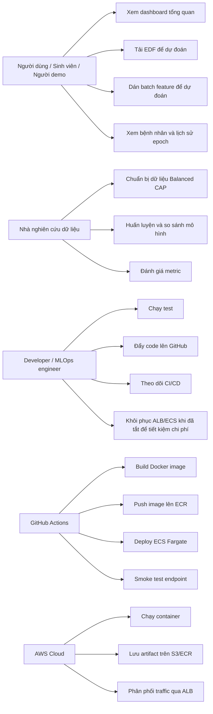

Các tác nhân chính:

- Người dùng demo: xem giao diện, thử dự đoán, đọc kết quả.
- Nhà nghiên cứu dữ liệu: chuẩn bị dữ liệu, train, phân tích metric.
- Developer/MLOps engineer: duy trì pipeline, test, deploy, monitoring.
- GitHub Actions: tự động hóa CI/CD.
- AWS: cung cấp hạ tầng chạy web app và lưu artifact.

## 1.4. Biểu đồ hoạt động

### 1.4.1. Hoạt động huấn luyện mô hình

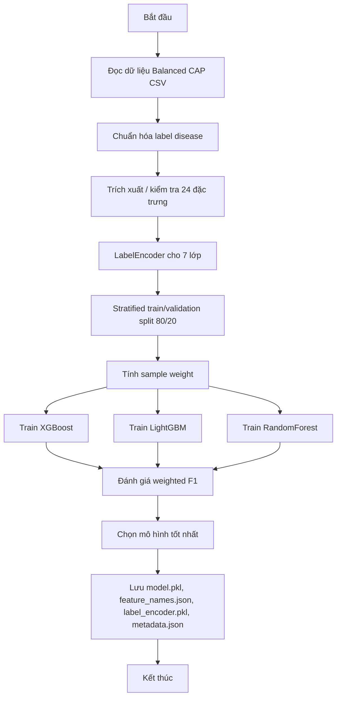

### 1.4.2. Hoạt động dự đoán qua EDF

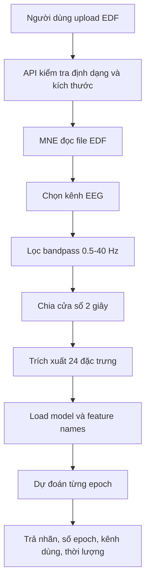

### 1.4.3. Hoạt động CI/CD

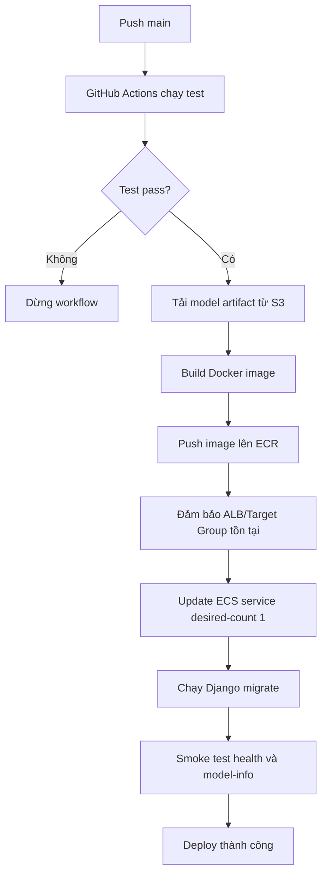

## 1.5. Biểu đồ trình tự

### 1.5.1. Trình tự dự đoán bằng feature

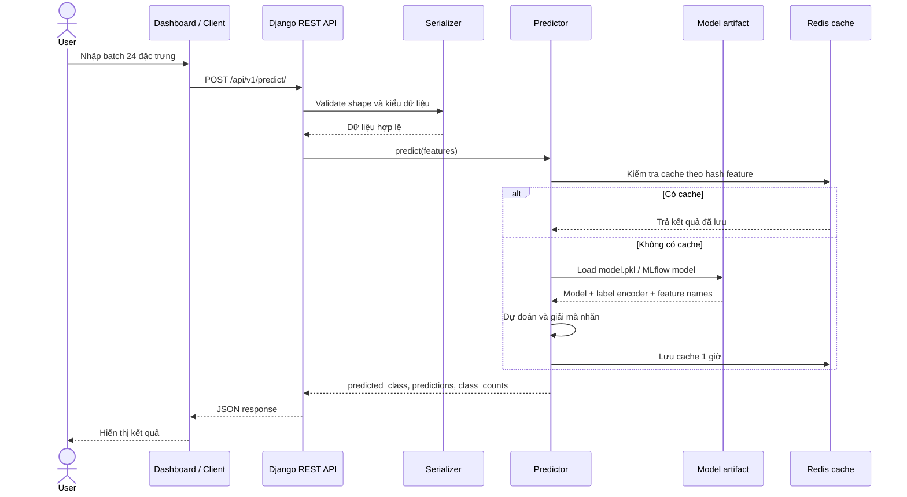

### 1.5.2. Trình tự IoT ingest

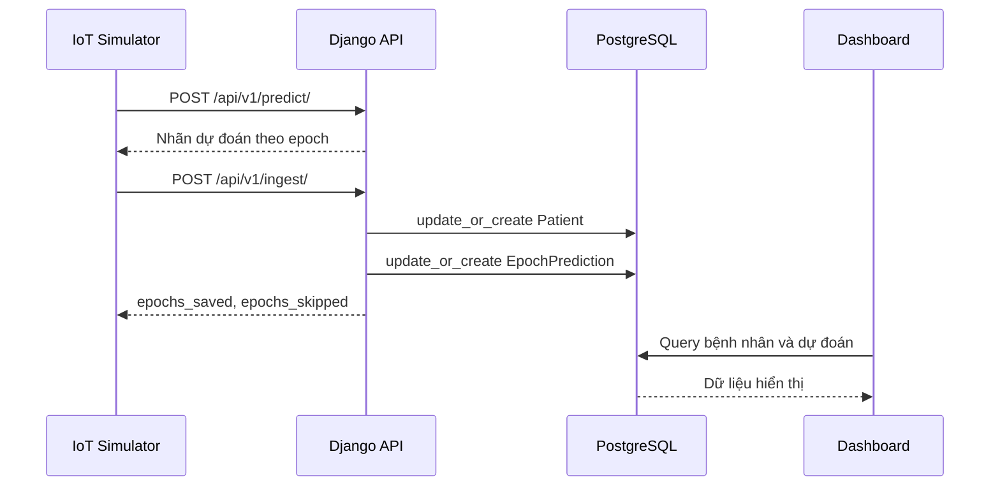

## 1.6. Biểu đồ lớp (Class diagram)

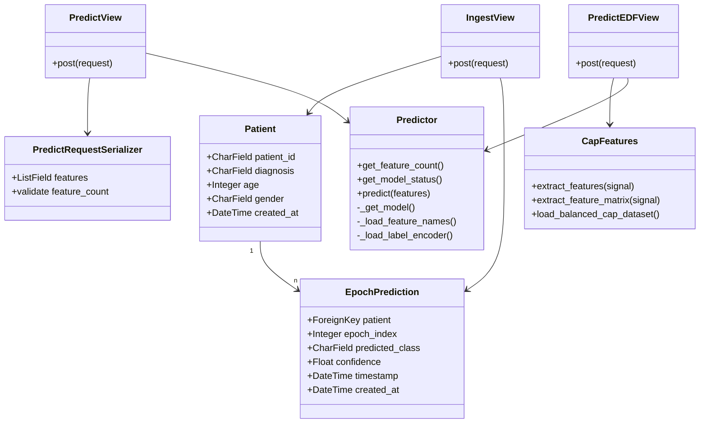

Ý nghĩa các lớp chính:

- `Patient`: lưu thông tin bệnh nhân/mẫu mô phỏng.
- `EpochPrediction`: lưu kết quả dự đoán từng epoch, giúp vẽ timeline và thống kê.
- `PredictRequestSerializer`: đảm bảo input API có đúng số feature mà model yêu cầu.
- `PredictView`: phục vụ dự đoán từ bảng feature.
- `PredictEDFView`: xử lý file EDF đầu vào, trích xuất feature và gọi model.
- `IngestView`: nhận dữ liệu mô phỏng IoT và ghi vào database.
- `Predictor`: lớp dịch vụ load model, cache, dự đoán, giải mã nhãn.
- `CapFeatures`: module dùng chung để đảm bảo notebook, training, API và IoT đều dùng cùng một chuẩn feature.

## 1.7. Biểu đồ luồng dữ liệu Database diagram

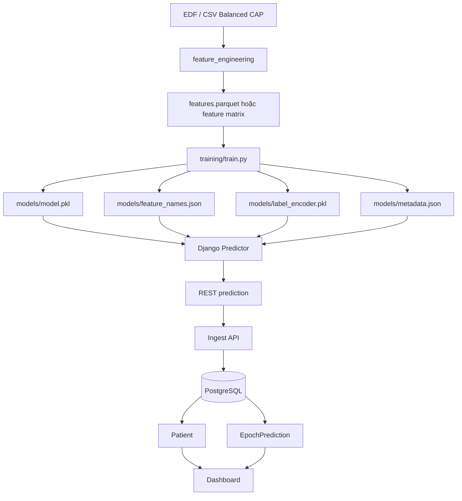

Luồng dữ liệu được chia làm hai nhánh:

- Nhánh offline: dữ liệu thô -> feature -> training -> model artifact.
- Nhánh online: API nhận feature/EDF -> model dự đoán -> lưu kết quả -> dashboard hiển thị.

## 1.8. Biểu đồ mối quan hệ giữa các dữ liệu

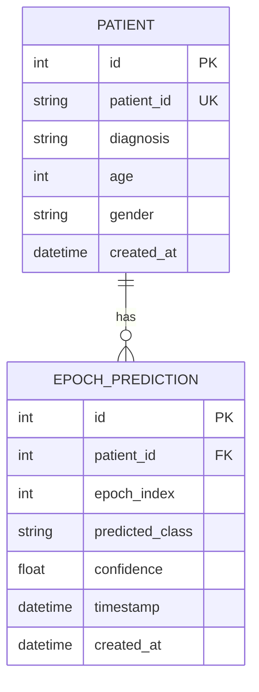

Quy tắc dữ liệu quan trọng:

- `Patient.patient_id` là duy nhất.
- Một bệnh nhân có nhiều epoch dự đoán.
- Cặp `(patient, epoch_index)` là duy nhất để tránh ghi trùng cùng một epoch.
- `predicted_class` lưu nhãn model trả về, còn `diagnosis` là nhãn bệnh/nhóm bệnh gắn với bệnh nhân hoặc dữ liệu mô phỏng.

## 1.9. Thiết kế giao diện

Giao diện nằm trong `sleep_portal/dashboard/templates/dashboard/`, sử dụng Django Template, Bootstrap và Chart.js. Các màn hình chính:

| Giao diện | File | Mục đích |
|---|---|---|
| Tổng quan | `home.html` | Hiển thị KPI: số bệnh nhân, số epoch dự đoán, phân bố chẩn đoán, hoạt động gần đây |
| Danh sách bệnh nhân | `patient_list.html` | Lọc/xem các bệnh nhân đã ingest |
| Chi tiết bệnh nhân | `patient_detail.html` | Xem timeline dự đoán theo epoch và thống kê từng bệnh nhân |
| Dự đoán | `predict.html` | Cho phép nhập feature, dùng sample JSON, hoặc upload EDF |
| Quy trình | `pipeline.html` | Tóm tắt model registry, CI/CD, monitoring, retrain và kiến trúc |

Nguyên tắc thiết kế:

- Dashboard ưu tiên đọc nhanh số liệu, không làm như landing page.
- Các chức năng kỹ thuật như API/model/pipeline được gom vào trang riêng để dễ demo.
- Trang dự đoán cho phép thử nhanh cả hai luồng: batch feature và EDF.
- Trang bệnh nhân phục vụ luồng IoT: sau khi simulator ingest, dữ liệu xuất hiện trên dashboard.

## 1.10. Thiết kế giải thuật

### 1.10.1. Tổng quan mô hình đề xuất

Mô hình hiện tại là pipeline học máy cổ điển cho tín hiệu EEG:

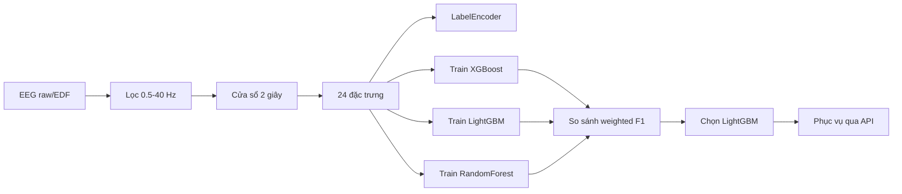

Lý do chọn hướng này:

- Dữ liệu sau feature engineering là dạng bảng; các mô hình cây như RandomForest, XGBoost, LightGBM thường phù hợp với dữ liệu tabular [14], [15], [16].
- Feature thủ công giúp giải thích tín hiệu dễ hơn so với mô hình deep learning thuần raw signal.
- LightGBM có tốc độ train tốt nhờ các kỹ thuật như GOSS và EFB [16].
- Trong metadata hiện tại, LightGBM đạt weighted F1 cao nhất so với XGBoost và RandomForest.
- Pipeline nhẹ hơn deep learning, dễ đóng gói trong Docker và phục vụ qua Django API.

### 1.10.2. Chuẩn tín hiệu và cửa sổ

Notebook chuẩn sử dụng:

- Sampling rate: `512 Hz`.
- Window size: `1024 samples`.
- Thời lượng mỗi cửa sổ: `1024 / 512 = 2 giây`.
- Label column: `disease`.

Việc chia cửa sổ ngắn giúp biến bản ghi dài thành nhiều mẫu học máy. Tuy nhiên, đây cũng là điểm cần cẩn thận: nếu chia train/validation ngẫu nhiên theo cửa sổ, các cửa sổ từ cùng bệnh nhân có thể xuất hiện ở cả hai tập, gây nguy cơ data leakage. Hướng phát triển nên tách theo bệnh nhân.

### 1.10.3. Rút trích 24 đặc trưng

Danh sách feature được cố định trong `models/feature_names.json` và `feature_engineering/cap_features.py`:

| Nhóm | Feature |
|---|---|
| Công suất phổ | `delta_power`, `theta_power`, `alpha_power`, `beta_power`, `gamma_power` |
| Tỷ lệ công suất | `delta_rel`, `theta_rel`, `alpha_rel`, `beta_rel`, `gamma_rel` |
| Đặc trưng tần số | `spectral_entropy`, `peak_frequency`, `mean_frequency` |
| Đặc trưng biên độ | `amplitude_mean`, `amplitude_std`, `rms` |
| Tỷ số phổ | `delta_beta_ratio`, `theta_alpha_ratio` |
| Thống kê phân phối | `skewness`, `kurtosis` |
| Tín hiệu thời gian | `zero_crossing_rate` |
| Hjorth | `hjorth_activity`, `hjorth_mobility`, `hjorth_complexity` |

Bandpower được tính từ ước lượng mật độ phổ công suất. Project dùng cách tiếp cận kiểu Welch để ước lượng phổ, phù hợp cho tín hiệu hữu hạn và có nhiễu [8], [9]. Với mỗi dải tần:

- Delta: 0.5-4 Hz.
- Theta: 4-8 Hz.
- Alpha: 8-13 Hz.
- Beta: 13-30 Hz.
- Gamma: 30-40 Hz.

Công suất dải tần:

```text
band_power = integral(PSD(f), f_low, f_high)
relative_power = band_power / total_power
```

Spectral entropy đo mức phân tán/độ phức tạp của phổ. Hjorth activity, mobility và complexity là các descriptor miền thời gian kinh điển cho EEG [10].

### 1.10.4. Huấn luyện và chọn mô hình

Pipeline trong `training/train.py`:

1. Đọc Balanced CAP CSV hoặc `features.parquet`.
2. Kiểm tra đủ 24 feature.
3. Encode nhãn bằng `LabelEncoder` [12].
4. Chia train/validation theo tỷ lệ 80/20, có `stratify` để giữ tương quan phân bố lớp [11].
5. Tính sample weight để giảm ảnh hưởng mất cân bằng lớp.
6. Huấn luyện 3 mô hình:
   - XGBoost [15].
   - LightGBM [16].
   - RandomForest [14].
7. Đánh giá bằng accuracy và weighted F1.
8. Ghi MLflow run và lưu artifact [17].

Kết quả hiện tại trong `models/metadata.json`:

| Model | Weighted F1 | Accuracy |
|---|---:|---:|
| XGBoost | 0.5840 | 0.5814 |
| LightGBM | 0.5929 | 0.5908 |
| RandomForest | 0.5841 | 0.5855 |

LightGBM được chọn vì đạt metric tốt nhất trong 3 mô hình đang so sánh. Tuy nhiên, metric khoảng 0.59 cho thấy mô hình mới đủ mức demo, chưa đủ để xem là mô hình y tế đáng tin cậy.

### 1.10.5. Lưu artifact mô hình

Các artifact cần thiết:

| Artifact | Vai trò |
|---|---|
| `models/model.pkl` | Model phục vụ inference |
| `models/model.ubj` | Model XGBoost dạng UBJ nếu có |
| `models/label_encoder.pkl` | Giải mã số lớp thành tên lớp |
| `models/feature_names.json` | Khóa schema 24 feature |
| `models/metadata.json` | Metadata model: class, metric, sampling rate, window |
| `metrics.json` | Metric phục vụ DVC/GitHub |

Schema feature được lưu riêng để API không bị lệch thứ tự cột. Đây là điểm quan trọng vì mô hình cây phụ thuộc vào đúng thứ tự/ý nghĩa feature.

## 1.11. Thiết kế cách tiến hành Test

Chiến lược test gồm 5 lớp:

| Lớp test | Mục tiêu | Nơi thực hiện |
|---|---|---|
| Unit test feature | Đảm bảo `extract_features` trả đúng 24 feature, không NaN/Inf | `tests/test_features.py` |
| Unit test inference | Đảm bảo predictor load model/metadata và trả đúng cấu trúc | `tests/test_inference.py` |
| API test | Test `/predict/`, `/health/`, `/model-info/` | `tests/test_api.py` |
| CI test | Chạy pytest với Postgres và Redis service | `.github/workflows/ci.yml` |
| Smoke test production | Sau deploy gọi `/api/v1/health/` và `/api/v1/model-info/` | GitHub Actions deploy job |

Các lệnh kiểm tra local:

```powershell
cd sleep_portal
..\venv\Scripts\python.exe -m pytest ..\tests -q
```

```powershell
.\venv\Scripts\python.exe -m compileall feature_engineering training iot_simulation sleep_portal monitoring
```

Các tiêu chí pass tối thiểu:

- Test tự động pass.
- Model artifact tồn tại.
- API trả `{"status": "ok"}` ở endpoint health.
- `/api/v1/model-info/` trả `ready: true` và `feature_count: 24`.
- Deploy workflow không fail ở các bước build, migrate, smoke test.

---

# CHƯƠNG 2. HIỆN THỰC

## 2.1. Công nghệ sử dụng

| Nhóm | Công nghệ |
|---|---|
| Frontend | Django Template, Bootstrap 5, Chart.js |
| Dữ liệu | CAP/Balanced CAP, EDF/EDF+, Parquet, DVC, S3 |
| Xử lý tín hiệu | MNE-Python, PyEDFlib, NumPy, SciPy, pandas |
| Học máy | scikit-learn, XGBoost, LightGBM, RandomForest, MLflow |
| Web framework | Django 4.2, Django REST Framework, Gunicorn |
| Database/cache | PostgreSQL, Redis |
| MLOps/monitoring | GitHub Actions, Docker, ECR, ECS Fargate, ALB, Evidently AI |
| Infrastructure | Terraform, AWS IAM, Security Group, CloudWatch |

## 2.2. Kết quả đạt được

### 2.2.1. Chức năng chuẩn hóa dữ liệu và đặc trưng

Các file chính:

- `feature_engineering/cap_features.py`
- `feature_engineering/extract_features.py`
- `feature_engineering/preprocess.py`
- `params.yaml`
- `dvc.yaml`

Kết quả:

- Đã thống nhất schema 24 feature theo notebook.
- Tái sử dụng cùng một module feature cho training, API upload EDF và IoT simulation.
- Dữ liệu có thể đi theo pipeline DVC: preprocess -> extract_features -> train [18].
- Cửa sổ, sampling rate, danh sách feature, label đều được khóa rõ ràng.

Ý nghĩa:

- Giảm rủi ro training dùng một feature schema nhưng production dùng schema khác.
- Dễ kiểm thử vì feature extractor là module dùng chung.
- Dễ mở rộng sang cảm biến khác vì có điểm vào rõ ràng.

### 2.2.2. Chức năng huấn luyện mô hình

File chính:

- `training/train.py`
- `training/sagemaker_train.py`
- `models/metadata.json`

Kết quả:

- Train được 3 mô hình: XGBoost, LightGBM, RandomForest.
- Chọn model theo weighted F1.
- Export đầy đủ artifact cho serving.
- Có tham số trong `params.yaml` để tái lập train.

Lệnh train:

```powershell
.\venv\Scripts\python.exe training\train.py --data-dir data\raw\balanced_CAP --model-dir models --model-type all
```

Ý nghĩa:

- Notebook không còn là đoạn code rời; logic chính đã được đưa vào script có thể chạy lại.
- Model artifact có đủ metadata để API biết model cần bao nhiêu feature.
- Có nền tảng để sau này tự động retrain khi drift.

### 2.2.3. Chức năng REST API

File chính:

- `sleep_portal/api/views.py`
- `sleep_portal/api/serializers.py`
- `sleep_portal/inference/predictor.py`
- `sleep_portal/api/urls.py`

Endpoint:

| Method | Endpoint | Chức năng |
|---|---|---|
| GET | `/api/v1/health/` | Health check cho ALB/ECS |
| GET | `/api/v1/model-info/` | Trả metadata model đang phục vụ |
| POST | `/api/v1/predict/` | Dự đoán từ batch feature 24 cột |
| POST | `/api/v1/predict-edf/` | Upload EDF, trích xuất feature, dự đoán |
| POST | `/api/v1/ingest/` | Lưu kết quả mô phỏng IoT vào database |

Ý nghĩa:

- API tách riêng logic dự đoán khỏi giao diện.
- Có endpoint health để ALB và CI/CD kiểm tra hệ thống [28].
- Có endpoint model-info để xác nhận model production đúng schema 24 feature.
- Có cache Redis cho kết quả dự đoán lặp lại, giảm tải inference [23].

### 2.2.4. Chức năng dashboard

File chính:

- `sleep_portal/dashboard/views.py`
- `sleep_portal/dashboard/models.py`
- `sleep_portal/dashboard/templates/dashboard/*.html`
- `sleep_portal/dashboard/static/dashboard/css/site.css`

Kết quả:

- Trang tổng quan KPI.
- Trang danh sách bệnh nhân.
- Trang chi tiết bệnh nhân theo epoch.
- Trang dự đoán feature/EDF.
- Trang trạng thái pipeline MLOps.

Ý nghĩa:

- Người demo có thể thấy hệ thống hoạt động mà không cần gọi API thủ công.
- Kết quả từ simulator có thể được ghi vào DB và xem lại theo bệnh nhân.
- Giao diện giúp giải thích kiến trúc MLOps cho người xem.

### 2.2.5. Chức năng mô phỏng IoT

File chính:

- `iot_simulation/demo_local.py`
- `iot_simulation/multi_patient_demo.py`
- `iot_simulation/simulator.py`
- `iot_simulation/subscriber.py`

Kết quả:

- Có thể sinh dữ liệu mô phỏng hoặc lấy thống kê từ `feature_stats.json`.
- Gọi `/api/v1/predict/` để nhận nhãn.
- Gọi `/api/v1/ingest/` để lưu bệnh nhân/epoch.

Ý nghĩa:

- Mô phỏng luồng dữ liệu cảm biến gửi về backend.
- Tạo dữ liệu demo cho dashboard.
- Chuẩn bị kiến trúc cho tình huống thiết bị thật gửi dữ liệu theo thời gian.

### 2.2.6. Chức năng CI/CD và deploy

File chính:

- `.github/workflows/ci.yml`
- `docker/Dockerfile`
- `scripts/ensure_aws_alb.sh`
- `requirements-prod.txt`

Luồng CI/CD hiện tại:

1. Chạy pytest với Postgres và Redis.
2. Tải artifact model từ S3 nếu có [29].
3. Build Docker image [24].
4. Push image lên ECR [27].
5. Đảm bảo ALB/Target Group/Listener tồn tại.
6. Đăng ký ECS task definition revision mới với image SHA và biến MLOps (`MODEL_ARTIFACT_S3_URI`, `MLOPS_FEATURE_STORE_S3_URI`).
7. Update ECS Fargate service sang task definition mới và `desired-count 1` [26].
8. Chạy `python manage.py migrate --noinput` bằng ECS one-off task.
9. Smoke test `/health/` và `/model-info/`.

Ý nghĩa:

- Mỗi lần push `main`, web app tự deploy.
- Khi ECS service bị scale về 0 để tiết kiệm chi phí, workflow scale lại về 1.
- Khi ALB bị xóa, script có thể tạo lại ALB/target group/listener nếu các resource nền còn đủ.
- Smoke test giúp phát hiện deploy “xanh giả”.

### 2.2.7. Chức năng monitoring và retrain

File chính:

- `.github/workflows/monitoring.yml`
- `.github/workflows/retrain.yml`
- `.github/workflows/mlflow.yml`
- `monitoring/drift_detection.py`
- `monitoring/feature_store.py`
- `monitoring/retrain_flow.py`
- `monitoring/promote_rules.py`
- `scripts/export_reference_features.py`
- `scripts/ensure_mlflow_server.sh`
- `training/train.py`

Kết quả:

- Monitoring workflow có thể chạy theo lịch hoặc thủ công.
- Nếu chưa cấu hình `DRIFT_REFERENCE_DATA` và `DRIFT_CURRENT_DATA`, workflow skip sạch thay vì fail.
- Endpoint `/api/v1/ingest/` nhận thêm trường `features` trong từng epoch, lưu batch feature ra Parquet local và có thể upload lên `MLOPS_FEATURE_STORE_S3_URI`.
- `monitoring/drift_detection.py` đọc được một file Parquet, một thư mục local, một object S3 hoặc một S3 prefix gồm nhiều file Parquet.
- Drift detection dùng Evidently AI để tạo HTML report và file `drift_summary_latest.json` [30].
- Nếu `alert=true`, workflow monitoring tự gọi workflow retrain.
- Retrain workflow chạy `training/train.py` ngay trên GitHub Actions, ghép dữ liệu nền với dữ liệu mới bằng `--extra-data`, log run vào MLflow Tracking Server production, đăng ký model vào MLflow Model Registry, promote model tốt nhất lên stage `Production` nếu weighted F1 vượt ngưỡng, upload artifact model lên S3, rồi kích hoạt lại CI/CD deploy.
- Workflow `mlflow.yml` build Docker image riêng cho MLflow, deploy thành ECS service riêng, dùng RDS PostgreSQL làm backend store và S3 làm artifact store.
- CI/CD build image mới bằng artifact vừa upload, push ECR và deploy ECS Fargate.
- Ứng dụng cũng có cấu hình `MODEL_ARTIFACT_S3_URI` để đồng bộ model artifact mới khi container khởi động.

Ý nghĩa:

- Vòng lặp MLOps hiện đã nối thành chuỗi: dữ liệu mới -> feature store -> drift report -> retrain -> MLflow Registry -> upload model artifact -> CI/CD deploy -> smoke test.
- MLflow production hiện có thể xem tại `http://sleep-portal-alb-67325866.ap-southeast-1.elb.amazonaws.com:5000`; đây là nơi quan sát experiment, run, metric, artifact và stage `Production`.
- GitHub Actions là nơi quan sát log retrain/deploy; MLflow là nơi quan sát lịch sử huấn luyện/model registry; CloudWatch là nơi xem log runtime của ECS.

### 2.2.8. Chức năng hạ tầng AWS

Thành phần chính:

| Thành phần | Vai trò | Lý do chọn |
|---|---|---|
| ECR | Lưu Docker image | Tích hợp trực tiếp với ECS |
| ECS Fargate | Chạy container Django | Không cần quản lý EC2 server, trả phí theo workload [26] |
| ALB | Public endpoint và health check | Phân phối traffic, kiểm tra target health [28] |
| MLflow Tracking Server | Lưu experiment, metric, artifact và Model Registry | Cần lịch sử huấn luyện/model version bền vững thay vì `mlruns` cục bộ [17] |
| S3 | Lưu model artifact/dữ liệu | Object storage phù hợp artifact lớn [29] |
| PostgreSQL/RDS | Lưu bệnh nhân và prediction | Dữ liệu quan hệ rõ ràng |
| Redis | Cache inference | Giảm chi phí tính toán lặp lại |
| CloudWatch | Log/metric | Quan sát runtime |
| Terraform | Khai báo hạ tầng bằng code | Dễ tái lập, review và quản lý thay đổi [31] |

## 2.3. Cấu trúc thư mục

```text
.
├── .github/workflows/        # CI/CD, monitoring, retrain
├── data/                     # raw, processed, features
├── docker/                   # Dockerfile và docker compose local
├── feature_engineering/      # preprocess, extract feature, CAP feature schema
├── infrastructure/           # Terraform AWS
├── iot_simulation/           # mô phỏng cảm biến/IoT
├── models/                   # model.pkl, feature_names, label_encoder, metadata
├── monitoring/               # feature store, drift detection, promote rules, retrain flow
├── notebooks/                # notebook Kaggle chuẩn
├── scripts/                  # script khôi phục ALB, export reference data, deploy helper
├── sleep_portal/             # Django app
├── tests/                    # pytest
├── training/                 # train script
├── dvc.yaml                  # pipeline dữ liệu
├── params.yaml               # tham số pipeline
└── README.md
```

## 2.4. Luồng vận hành tổng quát

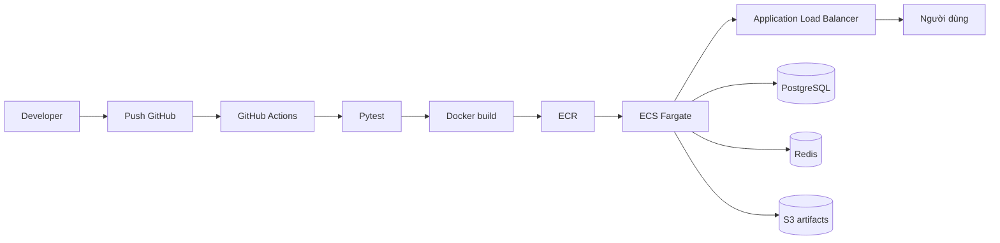

---

# CHƯƠNG 3. KẾT LUẬN

## 3.1. Kết quả đạt được

Project đã đạt được các kết quả quan trọng:

1. Có pipeline xử lý dữ liệu EEG theo chuẩn notebook Kaggle.
2. Có schema 24 feature thống nhất từ training đến serving.
3. Có mô hình phân loại 7 lớp rối loạn/bình thường.
4. Có API dự đoán bằng feature và bằng file EDF.
5. Có dashboard để xem tổng quan, bệnh nhân, dự đoán và trạng thái pipeline.
6. Có mô phỏng IoT gửi dữ liệu vào hệ thống.
7. Có test tự động bằng pytest.
8. Có Docker image production.
9. Có CI/CD tự deploy lên AWS ECS Fargate.
10. Có script khôi phục ALB khi đã xóa để tiết kiệm chi phí.
11. Có vòng lặp MLOps tự động: ingest feature mới, phát hiện drift, retrain, upload artifact và kích hoạt redeploy.

Hạn chế hiện tại:

- Metric model còn thấp: weighted F1 khoảng 0.59.
- Chưa chắc đã tách train/validation/test theo bệnh nhân, nên có nguy cơ leakage.
- Dữ liệu đang tập trung vào EEG, trong khi cảm biến giấc ngủ thực tế có thể gồm SpO2, ECG, airflow, effort, actigraphy.
- API hiện chủ yếu trả nhãn, chưa trả xác suất đầy đủ cho từng lớp.
- Chưa có calibration, uncertainty estimation hoặc giải thích dự đoán.
- Vòng retrain hiện dùng nhãn/pseudo-label từ dữ liệu ingest nếu chưa có nhãn bác sĩ xác nhận, nên cần quy trình kiểm duyệt dữ liệu trước khi dùng thật.
- MLflow production đã được tách thành ECS service riêng, nhưng hiện vẫn đang public qua ALB port `5000`; nếu dùng lâu dài nên thêm xác thực, HTTPS/domain riêng hoặc giới hạn IP.
- Terraform và script AWS CLI đang cùng tồn tại; về lâu dài nên đưa toàn bộ hạ tầng về Terraform state để tránh lệch trạng thái.
- Giao diện và thông điệp cảnh báo y tế cần được làm rõ hơn nếu demo cho người không chuyên.

Đánh giá mức phù hợp với đề tài:

- Phù hợp ở mức prototype kỹ thuật và demo MLOps.
- Phù hợp để trình bày quy trình từ dữ liệu cảm biến -> feature -> mô hình -> API -> dashboard -> cloud deployment.
- Chưa phù hợp để xem là mô hình hỗ trợ quyết định lâm sàng thật.

## 3.2. Hướng phát triển trong tương lai

### Cải thiện dữ liệu và đánh giá

1. Tách train/validation/test theo bệnh nhân thay vì theo cửa sổ.
2. Tạo test set độc lập và cố định.
3. Báo cáo macro F1, per-class precision/recall, confusion matrix.
4. Lưu mapping bệnh nhân -> split để tái lập kết quả.
5. Bổ sung cảm biến ngoài EEG: EOG, EMG, ECG, SpO2, airflow, respiratory effort.
6. So sánh cửa sổ 2 giây với epoch 30 giây theo ngữ cảnh sleep scoring [4].

### Cải thiện mô hình

1. Thử mô hình sequence: TCN, LSTM, Transformer.
2. Thử CNN trên raw EEG hoặc spectrogram.
3. Dùng multi-channel PSG thay vì chỉ một kênh EEG.
4. Thêm feature theo chuỗi thời gian: rolling mean, transition pattern, sleep architecture.
5. Trả xác suất từng lớp và calibration bằng `CalibratedClassifierCV` [34].
6. Thêm explainability bằng SHAP/TreeExplainer [33].

### Cải thiện API và sản phẩm

1. Trả `probabilities` cho từng class.
2. Hiển thị timeline EDF theo epoch trên dashboard.
3. Cho phép tải report PDF/CSV sau khi dự đoán.
4. Thêm cảnh báo “không dùng để chẩn đoán y khoa”.
5. Thêm đăng nhập và phân quyền nếu triển khai public.
6. Thêm giới hạn request, audit log và kiểm soát file upload.

### Cải thiện MLOps và hạ tầng

1. Quản lý ALB, ECS, RDS, Security Group hoàn toàn bằng Terraform.
2. Dùng Terraform remote backend S3 + DynamoDB lock.
3. Tách workflow infrastructure và workflow application.
4. Thêm rollback image khi smoke test fail.
5. Lưu metric production: latency, error rate, class distribution, drift score.
6. Kết nối CloudWatch alarm hoặc notification khi service unhealthy.
7. Bảo vệ MLflow Tracking Server bằng HTTPS, domain riêng, xác thực hoặc giới hạn IP/VPN trước khi mở cho người dùng ngoài nhóm.
8. Thêm bước human approval trước khi promote model nếu dữ liệu mới chưa có nhãn xác nhận.

---

# Hướng dẫn chạy và vận hành

## Cài đặt môi trường local

```powershell
python -m venv venv
.\venv\Scripts\activate
pip install -r requirements.txt
pip install -r requirements-dev.txt
```

## Chạy test

```powershell
cd sleep_portal
..\venv\Scripts\python.exe -m pytest ..\tests -q
```

## Train lại model

```powershell
.\venv\Scripts\python.exe training\train.py --data-dir data\raw\balanced_CAP --model-dir models --model-type all
```

## Chạy Django local

```powershell
cd sleep_portal
..\venv\Scripts\python.exe manage.py migrate
..\venv\Scripts\python.exe manage.py runserver
```

Sau đó mở:

- Dashboard: `http://127.0.0.1:8000/`
- Health check: `http://127.0.0.1:8000/api/v1/health/`
- Model info: `http://127.0.0.1:8000/api/v1/model-info/`

## Chạy Docker local

```powershell
docker build -f docker/Dockerfile -t sleep-portal:local .
docker run --rm -p 8000:8000 sleep-portal:local
```

## Deploy production

Deploy production hiện được kích hoạt bằng push lên `main`:

```powershell
git add .
git commit -m "your message"
git push origin main
```

Workflow `.github/workflows/ci.yml` sẽ tự:

1. Chạy test.
2. Tải model artifact từ S3.
3. Build Docker image.
4. Push ECR.
5. Đảm bảo ALB public tồn tại.
6. Deploy ECS.
7. Chạy migrate.
8. Smoke test endpoint.

MLflow server dùng workflow riêng `.github/workflows/mlflow.yml`. Khi cần bật lại đầy đủ hệ thống production, chạy `mlflow.yml` trước hoặc song song với `ci.yml`.

## Bật lại web app sau khi tắt để tiết kiệm chi phí

Nếu chỉ scale ECS service về 0 hoặc xóa ALB, workflow hiện tại có thể bật lại khi push:

- ECS service được update về `desired-count 1`.
- `scripts/ensure_aws_alb.sh` tìm hoặc tạo lại ALB, target group, listener.
- `scripts/ensure_mlflow_server.sh` tìm hoặc tạo lại target group/listener port `5000` và ECS service `sleep-portal-mlflow-service`.
- Nếu listener đã đúng target group, script bỏ qua `ModifyListener` để tránh lỗi IAM không cần thiết.

Nếu đã xóa sâu hơn, ví dụ VPC, ECS service, RDS, security group hoặc IAM role, cần khôi phục bằng Terraform hoặc tạo lại resource trước khi deploy app.

## Cấu hình monitoring drift

Workflow `.github/workflows/monitoring.yml` cần một trong hai cách cấu hình:

1. Chạy thủ công và nhập:
   - `reference_data`
   - `current_data`
2. Tạo GitHub repository variables:
   - `DRIFT_REFERENCE_DATA`
   - `DRIFT_CURRENT_DATA`

Hai giá trị này có thể là path local trong runner hoặc `s3://...`. Nếu dùng S3, cần GitHub Secrets:

- `AWS_ACCESS_KEY_ID`
- `AWS_SECRET_ACCESS_KEY`

## Cấu hình vòng lặp MLOps tự động

Các biến nên đặt trong GitHub Repository Variables:

```text
DRIFT_REFERENCE_DATA=s3://sleep-mlops-651709/features/reference/features.parquet
DRIFT_CURRENT_DATA=s3://sleep-mlops-651709/monitoring/current
RETRAIN_TRAINING_DATA=s3://sleep-mlops-651709/features/reference/features.parquet
MODEL_ARTIFACT_S3_URI=s3://sleep-mlops-651709/models
MLFLOW_TRACKING_URI=http://sleep-portal-alb-67325866.ap-southeast-1.elb.amazonaws.com:5000
MLFLOW_MODEL_NAME=sleep-disorder-classifier
MODEL_PROMOTE_STAGE=Production
MODEL_PROMOTE_THRESHOLD=0.55
MODEL_REQUIRE_PROMOTION=true
DRIFT_THRESHOLD=0.3
```

Luồng tự động:

1. Simulator hoặc thiết bị gửi epoch có `features` vào `/api/v1/ingest/`.
2. API lưu bệnh nhân/prediction vào database và ghi feature batch ra `MLOPS_FEATURE_STORE_S3_URI`.
3. `monitoring.yml` đọc `DRIFT_REFERENCE_DATA` và `DRIFT_CURRENT_DATA`, sinh report Evidently.
4. Nếu drift vượt `DRIFT_THRESHOLD`, workflow tự gọi `retrain.yml`.
5. `retrain.yml` chạy `training/train.py --extra-data <current_data> --artifact-s3-uri <MODEL_ARTIFACT_S3_URI> --promote-stage Production`.
6. Model mới được log vào MLflow, đăng ký vào Registry, promote lên `Production` nếu vượt `MODEL_PROMOTE_THRESHOLD`, đồng thời label encoder, feature schema và metadata được upload lên S3.
7. Workflow retrain gọi lại `ci.yml` để build image mới, deploy ECS, migrate database và smoke test.

Tạo reference feature ban đầu từ dữ liệu CAP:

```powershell
python scripts/export_reference_features.py `
  --data-dir data/raw/balanced_CAP `
  --output data/features/reference/features.parquet `
  --s3-uri s3://sleep-mlops-651709/features/reference/features.parquet
```

Triển khai MLflow production trên ECS:

```powershell
gh workflow run mlflow.yml --ref main -f reason="Deploy production MLflow"
```

Sau khi workflow xong, mở:

```text
http://sleep-portal-alb-67325866.ap-southeast-1.elb.amazonaws.com:5000
```

Chạy MLflow UI local khi phát triển offline:

```powershell
docker compose -f docker/docker-compose.local.yml up db mlflow
```

Sau đó mở:

```text
http://localhost:5000
```

Trong production, `MLFLOW_TRACKING_URI` phải trỏ về MLflow ECS service ở trên để mọi lần train/retrain ghi vào cùng một nơi. CI/CD cũng truyền URI này vào ECS task definition của web app để serving ưu tiên load model từ Registry stage `Production`, sau đó mới fallback sang artifact S3.

---

# Kịch bản demo toàn bộ project

Mục tiêu demo: chứng minh hệ thống đi được trọn vòng đời MLOps: dữ liệu cảm biến/EEG -> trích xuất feature -> dự đoán -> lưu bệnh nhân -> ghi feature mới -> phát hiện drift -> retrain -> MLflow Registry -> CI/CD redeploy -> web app dùng model mới.

## Chuẩn bị trước khi demo

1. Mở GitHub repository và kiểm tra Secrets:
   - `AWS_ACCESS_KEY_ID`
   - `AWS_SECRET_ACCESS_KEY`
2. Kiểm tra GitHub Repository Variables:
   - `DRIFT_REFERENCE_DATA=s3://sleep-mlops-651709/features/reference/features.parquet`
   - `DRIFT_CURRENT_DATA=s3://sleep-mlops-651709/monitoring/current`
   - `RETRAIN_TRAINING_DATA=s3://sleep-mlops-651709/features/reference/features.parquet`
   - `MODEL_ARTIFACT_S3_URI=s3://sleep-mlops-651709/models`
   - `MLFLOW_TRACKING_URI=http://sleep-portal-alb-67325866.ap-southeast-1.elb.amazonaws.com:5000`
   - `MODEL_PROMOTE_STAGE=Production`
   - `MODEL_PROMOTE_THRESHOLD=0.55`
3. Bật lại các service nếu trước đó đã tắt để tiết kiệm chi phí:
   ```powershell
   gh workflow run mlflow.yml --ref main -f reason="Demo MLflow production"
   gh workflow run ci.yml --ref main -f reason="Demo web app production"
   ```
4. Đợi hai workflow xanh, sau đó kiểm tra:
   ```powershell
   curl http://sleep-portal-alb-67325866.ap-southeast-1.elb.amazonaws.com/api/v1/health/
   curl http://sleep-portal-alb-67325866.ap-southeast-1.elb.amazonaws.com/api/v1/model-info/
   curl http://sleep-portal-alb-67325866.ap-southeast-1.elb.amazonaws.com:5000/
   ```

## Luồng trình bày đề xuất

1. Giới thiệu bài toán:
   - Dữ liệu đến từ CAP Sleep/Balanced CAP.
   - Tín hiệu EEG được chia cửa sổ 2 giây.
   - Mỗi cửa sổ được biến thành 24 đặc trưng.
   - Mô hình phân loại 7 nhóm: `healthy`, `insomnia`, `narcolepsy`, `nfle`, `plm`, `rbd`, `sdb`.

2. Mở web app:
   - Truy cập `http://sleep-portal-alb-67325866.ap-southeast-1.elb.amazonaws.com`.
   - Vào dashboard tổng quan để xem số bệnh nhân, số epoch đã lưu và phân bố nhãn.
   - Vào trang Pipeline để chỉ ra model name, stage `Production`, tracking URI, artifact S3 và feature store S3.

3. Kiểm tra API serving:
   - Mở `/api/v1/health/` để chứng minh service sống.
   - Mở `/api/v1/model-info/` để chứng minh model đã sẵn sàng, có 24 feature, có artifact sync S3 và có MLflow stage.

4. Demo dự đoán bằng feature:
   - Vào trang Predict trên giao diện, nhập hoặc dán một batch 24 feature.
   - Hoặc gọi API:
     ```powershell
     curl -X POST `
       http://sleep-portal-alb-67325866.ap-southeast-1.elb.amazonaws.com/api/v1/predict/ `
       -H "Content-Type: application/json" `
       -d "{\"features\":[[0.1,0.2,0.3,0.4,0.5,0.6,0.7,0.8,0.9,1.0,1.1,1.2,1.3,1.4,1.5,1.6,1.7,1.8,1.9,2.0,2.1,2.2,2.3,2.4]]}"
     ```
   - Giải thích rằng production serving sẽ ưu tiên MLflow Registry, nếu lỗi sẽ fallback `model.pkl` từ S3.

5. Demo luồng IoT nhiều bệnh nhân:
   ```powershell
   python iot_simulation/multi_patient_demo.py `
     --url http://sleep-portal-alb-67325866.ap-southeast-1.elb.amazonaws.com `
     --epochs 20 `
     --batch-size 5 `
     --workers 3
   ```
   - Script lấy thống kê feature, sinh epoch mô phỏng, gọi `/predict/`, rồi gửi kết quả vào `/ingest/`.
   - `/ingest/` lưu bệnh nhân và epoch vào PostgreSQL, đồng thời ghi feature batch ra `s3://sleep-mlops-651709/monitoring/current`.

6. Quay lại dashboard:
   - Mở danh sách bệnh nhân.
   - Chọn một bệnh nhân, xem timeline epoch và phân bố dự đoán.
   - Đây là phần chứng minh dữ liệu mới đã đi vào hệ thống thật.

7. Mở MLflow production:
   - Truy cập `http://sleep-portal-alb-67325866.ap-southeast-1.elb.amazonaws.com:5000`.
   - Chọn experiment `sleep-disorder-kaggle`.
   - Chỉ ra các run train/retrain, metric `val_f1_weighted`, `val_accuracy`, artifact và model `sleep-disorder-classifier`.
   - Vào Model Registry để xem version đang ở stage `Production`.

8. Demo monitoring drift:
   - Vào GitHub Actions -> `Monitoring - Drift Check` -> Run workflow.
   - Nhập:
     - `reference_data`: `s3://sleep-mlops-651709/features/reference/features.parquet`
     - `current_data`: `s3://sleep-mlops-651709/monitoring/current`
   - Sau khi chạy, mở artifact `drift-reports` để xem HTML report và `drift_summary_latest.json`.
   - Nếu `alert=true`, workflow tự gọi `retrain.yml`.

9. Demo retrain và promote:
   - Nếu muốn chủ động, chạy GitHub Actions -> `Retrain - Promote - Redeploy` -> Run workflow.
   - Dùng:
     - `training_data`: `s3://sleep-mlops-651709/features/reference/features.parquet`
     - `extra_data`: `s3://sleep-mlops-651709/monitoring/current`
     - `artifact_s3_uri`: `s3://sleep-mlops-651709/models`
     - `model_type`: `all`
     - `deploy_after_success`: `true`
   - Workflow sẽ train XGBoost/LightGBM/RandomForest, chọn weighted F1 tốt nhất, promote lên `Production` nếu vượt ngưỡng, upload artifact S3 và gọi lại `ci.yml`.

10. Demo CI/CD redeploy:
    - Mở workflow `CI/CD - Build, Test, Deploy`.
    - Chỉ ra các bước: test -> build Docker -> push ECR -> ensure ALB -> register ECS task definition -> deploy -> migrate -> smoke test.
    - Sau khi xanh, mở lại `/api/v1/model-info/` để xác nhận app đang chạy task mới và vẫn ready.

## Lời thoại ngắn khi demo

“Project này không chỉ train model trong notebook. Notebook Kaggle là quy chuẩn feature và mô hình; phần production biến nó thành hệ thống MLOps: web app nhận EEG/feature, model phục vụ qua API, dữ liệu mới được lưu vào feature store, drift được kiểm tra định kỳ, retrain được kích hoạt khi cần, MLflow lưu toàn bộ lịch sử huấn luyện và Model Registry quyết định version `Production`, còn GitHub Actions tự build/deploy lại ECS. Vì metric hiện mới khoảng 0.59 weighted F1, hệ thống phù hợp để demo kỹ thuật và quy trình MLOps, chưa được dùng như công cụ chẩn đoán y khoa.”

---

# Tài liệu tham khảo

[1] PhysioNet, CAP Sleep Database v1.0.0. https://physionet.org/content/capslpdb/1.0.0/

[2] Terzano M. G. et al., Atlas, rules, and recording techniques for the scoring of cyclic alternating pattern (CAP) in human sleep. https://pubmed.ncbi.nlm.nih.gov/14592244/

[3] Parrino L. et al., Cyclic alternating pattern (CAP): the marker of sleep instability. https://pubmed.ncbi.nlm.nih.gov/21616693/

[4] American Academy of Sleep Medicine, The AASM Manual for the Scoring of Sleep and Associated Events. https://aasm.org/clinical-resources/scoring-manual/

[5] EDF+ specification, European Data Format. https://www.edfplus.info/specs/edfplus.html

[6] MNE-Python documentation/repository. https://github.com/mne-tools/mne-python

[7] PyEDFlib documentation. https://pyedflib.readthedocs.io/

[8] SciPy, `scipy.signal.welch`. https://docs.scipy.org/doc/scipy/reference/generated/scipy.signal.welch.html

[9] Welch P. D., The Use of Fast Fourier Transform for the Estimation of Power Spectra. https://research.ibm.com/publications/the-use-of-fast-fourier-transform-for-the-estimation-of-power-spectra-a-method-based-on-time-averaging-over-short-modified-periodograms

[10] Hjorth B., EEG analysis based on time domain properties. https://doi.org/10.1016/0013-4694(70)90143-4

[11] scikit-learn, `train_test_split`. https://scikit-learn.org/stable/modules/generated/sklearn.model_selection.train_test_split.html

[12] scikit-learn, `LabelEncoder`. https://scikit-learn.org/stable/modules/generated/sklearn.preprocessing.LabelEncoder.html

[13] scikit-learn, `classification_report`. https://scikit-learn.org/stable/modules/generated/sklearn.metrics.classification_report.html

[14] scikit-learn, `RandomForestClassifier`. https://scikit-learn.org/stable/modules/generated/sklearn.ensemble.RandomForestClassifier.html

[15] Chen T., Guestrin C., XGBoost: A Scalable Tree Boosting System. https://arxiv.org/abs/1603.02754

[16] Ke G. et al., LightGBM: A Highly Efficient Gradient Boosting Decision Tree. https://proceedings.neurips.cc/paper/2017/hash/6449f44a102fde848669bdd9eb6b76fa-Abstract.html

[17] MLflow Model Registry documentation. https://www.mlflow.org/docs/latest/ml/model/

[18] DVC, Defining Pipelines. https://dvc.org/doc/user-guide/pipelines/defining-pipelines

[19] Django documentation. https://docs.djangoproject.com/

[20] Django REST Framework, APIView. https://www.django-rest-framework.org/api-guide/views/

[21] Django REST Framework, Serializers. https://www.django-rest-framework.org/api-guide/serializers/

[22] PostgreSQL documentation. https://www.postgresql.org/docs/

[23] Redis documentation. https://redis.io/docs/latest/

[24] Docker, Dockerfile overview. https://docs.docker.com/build/concepts/dockerfile/

[25] GitHub Actions, About workflows. https://docs.github.com/actions/using-workflows/about-workflows

[26] AWS Fargate documentation. https://aws.amazon.com/documentation-overview/fargate/

[27] Amazon Elastic Container Registry documentation. https://docs.aws.amazon.com/ecr/

[28] Elastic Load Balancing, Application Load Balancer target group health checks. https://docs.aws.amazon.com/elasticloadbalancing/latest/application/target-group-health-checks.html

[29] Amazon S3 documentation. https://docs.aws.amazon.com/AmazonS3/latest/userguide/

[30] Evidently AI, Data Drift documentation. https://docs.evidentlyai.com/metrics/preset_data_drift

[31] AWS Prescriptive Guidance, Using Terraform as an IaC tool for the AWS Cloud. https://docs.aws.amazon.com/prescriptive-guidance/latest/choose-iac-tool/terraform.html

[32] Gunicorn documentation. https://docs.gunicorn.org/en/stable/

[33] SHAP documentation. https://shap.readthedocs.io/

[34] scikit-learn, Probability calibration. https://scikit-learn.org/stable/modules/calibration.html
